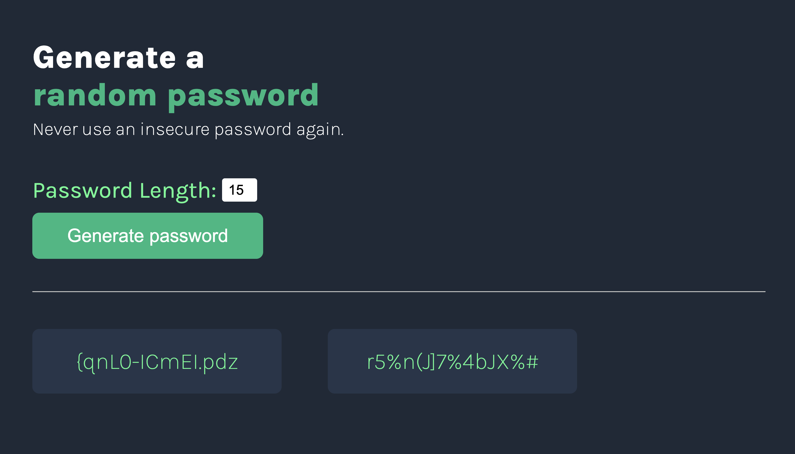

# Random Password Generator

A password generator built with HTML, CSS, and JavaScript that creates secure random passwords and allows users to copy them to the clipboard with a single click.

## Live Demo

https://shwarzbergzelda.github.io/Password-Generator-Scrimba/

## Preview

## Features

- Generate random secure passwords
- Adjustable password length
- Copy passwords to clipboard by clicking
- Modern and responsive UI
- Instant password generation

## Built With

- HTML5
- CSS3
- JavaScript (ES6)

## What I Learned

- DOM manipulation
- Event handling
- Generating random values from arrays
- Clipboard API
- Flexbox layouts
- Deploying projects with GitHub Pages

## Author

**Zelda Shwarzberg**

GitHub: https://github.com/shwarzbergzelda
